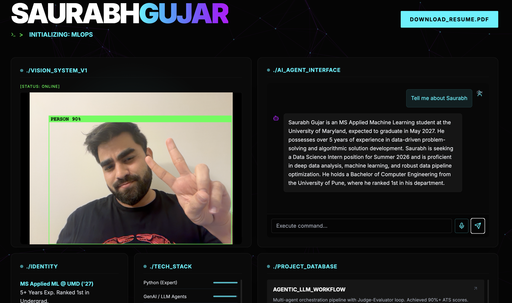

# Saurabh Gujar | Interactive AI Portfolio



**Live Site:** [https://ai-portfolio.vercel.app](https://ai-portfolio.vercel.app)

## ⚡ The "Why" Behind This Project

I built this portfolio to solve a specific problem: **Static PDF resumes don't prove engineering skills.**

As an MS student specializing in **Applied Machine Learning (UMD)** and **AI Agents**, I wanted a platform that demonstrates my tech stack in real-time.
## Engineering Architecture

### 1. Agentic RAG Chat & Multi-Provider Support
Instead of hard-coding a single AI provider, I architected the chat backend to be adaptable.
- **Active Engine:** **Google Gemini 2.5 Flash** (via Vercel AI SDK).
- **Why Gemini?** Chosen for its massive context window (1M tokens) allowing for deep resume analysis, and low latency (<500ms) on the Edge.
- **Resilience:** The codebase architecture includes adapters for **Hugging Face** (Mistral/Zephyr), allowing for model switching if a provider goes down.
- **RAG Implementation:** The agent is fed a structured context window (`RESUME_DATA`) to answer specific metrics about my experience without hallucinations.

### 2. Edge AI & Computer Vision
- **Tech:** TensorFlow.js (COCO-SSD model).
- **Strategy:** Client-Side Inference.
- **Why:** By running the model directly in the browser, I achieve **60 FPS real-time detection** with zero server latency and total user privacy (video frames never leave the client).

### 3. MLOps Observability
- I included a real-time **System Latency Monitor** in the footer.
- It pings a lightweight `GET` endpoint on the Next.js Edge Runtime to measure round-trip system health, mimicking production MLOps dashboards I've built using Prometheus.

---

## Tech Stack

| Component | Technology |
| :--- | :--- |
| **Framework** | Next.js 14 (App Router) |
| **Language** | TypeScript |
| **AI Engine** | **Google Gemini 1.5 Flash** |
| **Vision** | TensorFlow.js (Client-Side) |
| **Styling** | Tailwind CSS + Lucide React |
| **Deployment** | Vercel (Edge Runtime) |

---

## 🚀 Getting Started

If you want to run this locally or fork the architecture:

1. **Clone the repo**
   ```bash
   git clone [https://github.com/your-username/ai-portfolio.git](https://github.com/your-username/ai-portfolio.git)
   cd ai-portfolio
   

2. **Install dependencies**

   ```bash
    npm install
   
3. Set up Environment Variables Create a .env.local file in the root directory:
Get a free key from aistudio.google.com
    ```bash
    GOOGLE_GENERATIVE_AI_API_KEY=AIz--YOUR_API_KEY
   
4. Run the development server
    ```bash
   npm run dev
   
Open http://localhost:3000 with your browser to see the result.


## 📌 Project Status
- [x] v1.0: Core RAG Chat & Vision System deployed.

- [x] v1.1: Added Voice I/O (Speech Synthesis/Recognition).

- [x] v1.2: Integrated GitHub Contribution Heatmap.

- [ ] Future: Implementing a vector database (Pinecone) for larger document ingestion.


## 📬 Contact
### Saurabh Gujar

 - Email: saurabhgujar17@gmail.com

 - LinkedIn: https://www.linkedin.com/in/saurabh-gujar

 - Github : https://www.github.com/saurabh1712

 - Built with ☕ and Neural Networks at _UMD._ :)